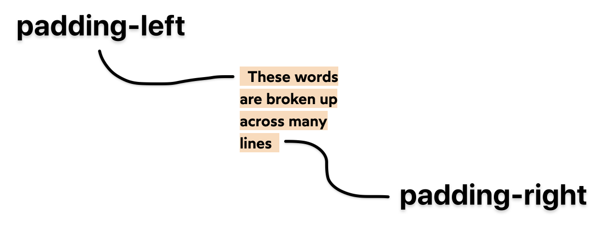
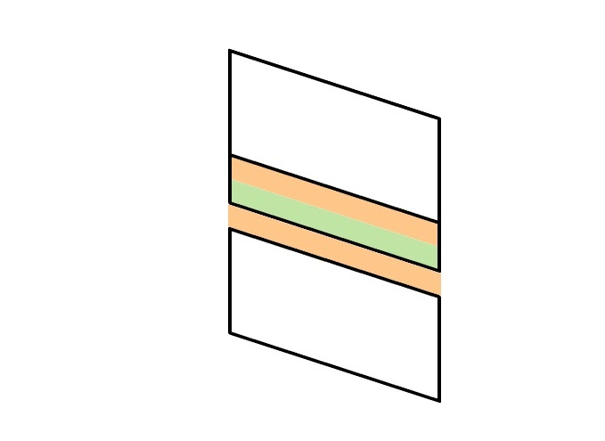

# CSS for JS

[This is the course](https://css-for-js.dev/)

## Module 0

1. CSS ‘declaration’ is a single property-value combination.

1. A CSS ‘rule’ is the whole thing I.e:

   ```css
   .foo {
     font-size: 15px;
   }
   ```

1. Use HSL for colors

1. Much more intuitive

1. Other color formats like LAB and LCH will be available in the future

1. DON’T set a px font size on the html tag. This will override a user's chosen
   default font size.

1. > A common question I see from developers is "which unit should I use when?".
   > Here's how I think about it: :
   >
   > 1. For **typography, I generally use rem**, because it has important
   >    accessibility benefits.
   > 1. When it comes to **properties that relate to the box model** — padding,
   >    border, margin — I usually **use pixels**. It's more intuitive than rem,
   >    and there isn't a clear accessibility win.
   > 1. For width/height, it'll depend on whether I want the element to be a
   >    fixed size, or a relative size. I might want one div to always be 250px
   >    wide, while another one should be 50% of the available space.
   > 1. For **color**, as we saw in the last lesson, I **prefer hsl**.

1. Recommended minimum for line-height is 1.5 For colors, target contrast
   ratio > 4.5 for small text, > 3 for large text

1. Firefox has a feature that helps you debug when a property is used without
   another dependent property being set. I.e. an inline element can’t have a
   width unless you set its display explicitly to something like
   `display: block;` or `display: inline-block;`.

## Module 1

1. Most properties that inherit are typography-related, like color, font-size,
   text-shadow:
   [https://www.sitepoint.com/css-inheritance-introduction/#list-css-properties-inherit](https://www.sitepoint.com/css-inheritance-introduction/#list-css-properties-inherit)

1. The cascade (least specific -> most specific)
   [https://wattenberger.com/blog/css-cascade#position](https://wattenberger.com/blog/css-cascade#position)

   1. Importance -> Origin -> Specificity -> Position
   1. Specificity order
      1. Applied styles
      1. Tag styles
      1. Class styles
      1. ID styles
      1. Inline styles
      1. Important styles

1. CSS has a block direction (vertical) and an inline direction (horizontal)

1. Note that browsers use:

   ```css
   margin-block-start: 1em;
   margin-block-end: 1em;
   margin-inline-start: 0px;
   margin-inline-end: 0px;
   ```

   Because they need to support both left-to-right and right-to-left languages

1. Use negative margins to ‘escape’ a wrapper’s padding. This is handy when you
   want to make a full-width image in between padded text.

1. With inline elements, you can’t change dimensions or things like
   padding/margin

   1. EXCEPT img, video, canvas

1. Inline elements are ‘polite’ in the sense that they don’t take up any extra
   space than they need to

1. Block elements are ‘greedy’ as they take up all the horizontal space

1. GOTCHA: inline elements have extra ‘magic space’. This is because the browser
   treats inline elements as if they’re typography. It makes sense that with
   text, you’d want a bit of extra space, so that the lines in a paragraph
   aren’t crammed in too tightly. To get around this:

   1. Set images to `display: block;`
   1. Set line-height on wrapping div to 0

1. For inline elements, space can also be caused by the whitespace between
   elements (this can happen through newlines in the html code, as well)

1. Inline elements can line-wrap

1. Box-decoration-break: clone can be used to make wrapping elements consistent
   across each line-wrap block

   1. Before – box-decoration-break: slice; (default):

      

   1. After (box-decoration: clone;):

      

1. Inline-block doesn’t line-wrap

1. Border-box does NOT include margin in width and height

1. Width

   1. Min-content
      1. Breaks on every line-break/child
   1. Max-content
      1. No line-breaks
   1. Fit-content
      1. If width can fit in the container, it behaves like max-content, not
         adding any line-breaks. However, if content is too wide, it adds
         line-breaks as needed

1. Max-width and min-width can mix units

1. Don’t use 100vh for taking up all the height

   1. Make sure html and body have height 100% and then this works seamlessly
      for mobile

      ```css
      html,
      body {
        height: 100%;
      }
      .wrapper {
        display: flex;
        flex-direction: column;
        min-height: 100%;
      }
      footer {
        border: solid hotpink;
        padding: 8px;
        margin-top: auto;
      }
      ```

      ```html
      <div class="wrapper">
        <p>I fill the viewport!</p>
        <footer>I'm at the bottom</footer>
      </div>
      ```

1. ONLY VERTICAL MARGINS COLLAPSE

1. `writing-mode: vertical-lr;` is a thing???

1. Margin collapse is **unique to flow layout**

1. Nesting does NOT prevent collapsing

1. Padding BLOCKS margin-collapse

   1. Padding between a child and the parent blocks margin collapse

      

1. A gap between two margins BLOCKS margin-collapse

1. MARGINS MUST BE TOUCHING IN ORDER TO COLLAPSE

1. Padding, borders, and other sibling elements block margin collapse

## Module 2

1. Default value of the `position` property is is `static`

   1. Just means it’s **not** using static layout method
   1. Using some other layout mode that could be flow, grid, or flexbox

1. Position relative enables some attributes like top, right, bottom, left

1. For absolute positioning, `display: inline;` and `display: block;` are
   basically the same

1. Absolute position centering trick:

   ```css
   .box {
     position: absolute;
     top: 0px;
     left: 0px;
     right: 0px;
     bottom: 0px;
     width: 100px;
     height: 100px;
     margin: auto;
     background: deeppink;
   }
   ```

   Use this trick for things like modals

1. Absolute elements can **only be contained by other elements using Positioned
   layout**.

1. > Padding is used in Flow layout calculations, and absolute elements are
   > taken out-of-flow. Those rules don't apply.

   1. **Padding is ignored for absolute positioning**

1. Circles exercise

   ```html
   <style>
     .box {
       position: relative;
       height: 150px;
       margin: 64px;
     }

     .bordered {
       --border-width: 4px;
       border: var(--border-width) solid palevioletred;
     }

     .circle {
       --size: 20px;
       --centered-offset: calc(0.5 * (var(--size) + var(--border-width)));

       position: absolute;

       height: var(--size);
       width: var(--size);

       border-radius: 50%;
       background-color: white;
     }

     .big {
       --size: 65px;

       top: -25px;
       left: -25px;
     }

     .medium {
       --size: 30px;

       top: 40px;
       left: calc(-1 * var(--centered-offset));
     }

     .small {
       --size: 25px;

       top: calc(-1 * var(--centered-offset));
       left: 50px;
     }
   </style>
   <html>
     <div class="box bordered">
       <div class="big circle bordered"></div>
       <div class="medium circle bordered"></div>
       <div class="small circle bordered"></div>
     </div>
   </html>
   ```

1. Absolute-positioned shrink to contain their content.

1. As a general rule, positioned elements will always render on top of
   non-positioned ones.

1. z-index only works with positioned elements (and the children of grid and
   flex layouts). It will have no effect on an element being rendered in Flow
   layout.

1. We can create a stacking context by combining a non-static position with a
   z-index. Other ways:

   1. Setting opacity to a value less than 1
   1. Setting position to fixed or sticky (No z-index needed for these values!)
   1. Applying a mix-blend-mode other than normal
   1. Adding a z-index to a child inside a display: flex or display: grid
      container
   1. Using transform, filter, clip-path, or perspective
   1. Explicitly creating a context with isolation: isolate (More on this soon!)
   1. Full reference:
      https://developer.mozilla.org/en-US/docs/Web/CSS/CSS_Positioning/Understanding_z_index/The_stacking_context.

1. Can ALSO create a stacking context with: `isolation: isolate;`

1. A portal is the concept of a child element being able to display in a
   'global' context

   1. For example, a modal rendering a child element so that it 'escapes' its
      stacking context

1. For fixed positioning, if a parent or grandparent uses the `transform`
   property, it becomes the containing block for the fixed element,
   **essentially transforming it into an absolutely-positioned element**

   1. i.e. **Transformed parents can't have fixed children**

1. **Always add a comment when employing `overflow: hidden;` declaration.
   Future-you will thank you.**

1. Sometimes, we'll want to use overflow-x or overflow-y to clip the overflow in
   one axis, but not affect the other. Unfortunately, **this isn't possible in
   CSS.**

   1. Children of a scroll container are essentially locked inside that box.
      They can't ever spill outside its parent's bounds. It doesn't matter if we
      only set overflow-x or overflow-y. There's no such thing as a scroll
      container that only scrolls in one axis.
   1. We're given the ability to set discrete values for overflow-x and
      overflow-y in case we want one axis to be hidden and one axis to be
      scrollable. But that's all they're used for. They can't be used to allow
      "normal" visible overflow in one axis.

1. Sticky elements are in-flow and are only sticky to their parent container

1. `position: sticky;` does nothing unless it's coupled with at least one `top`,
   `bottom`, `left`, `right` value.

## Module 3

1. styled-components allow you to put styles and behavior in an encapsulated
   component

1. details and summary HTML5 elements are a thing

1. styled-components is easily my most enjoyable CSS experience and what I was
   trying to do with using CSS in JS with Incremental IT, but much better
