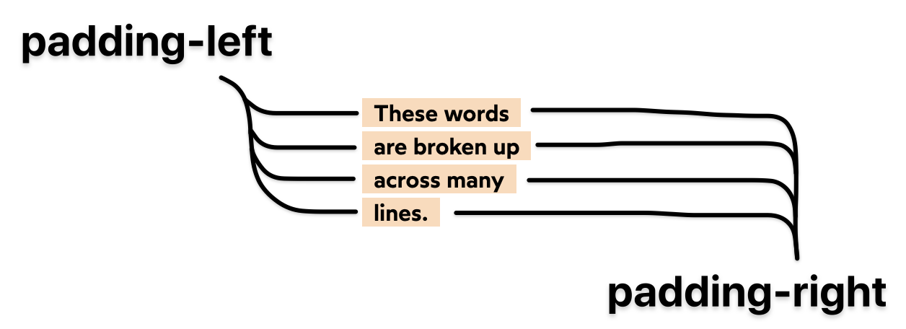

# CSS for JS

[This is the course](https://css-for-js.dev/)

## Module 0 – Fundamentals Recap

1. CSS ‘declaration’ is a single property-value combination.

1. A CSS ‘rule’ is the whole thing I.e:

   ```css
   .foo {
     font-size: 15px;
   }
   ```

1. Use HSL for colors

1. Much more intuitive

1. Other color formats like LAB and LCH will be available in the future

1. DON’T set a px font size on the html tag. This will override a user's chosen
   default font size.

1. > A common question I see from developers is "which unit should I use when?".
   > Here's how I think about it: :
   >
   > 1. For **typography, I generally use rem**, because it has important
   >    accessibility benefits.
   > 1. When it comes to **properties that relate to the box model** — padding,
   >    border, margin — I usually **use pixels**. It's more intuitive than rem,
   >    and there isn't a clear accessibility win.
   > 1. For width/height, it'll depend on whether I want the element to be a
   >    fixed size, or a relative size. I might want one div to always be 250px
   >    wide, while another one should be 50% of the available space.
   > 1. For **color**, as we saw in the last lesson, I **prefer hsl**.

1. Recommended minimum for line-height is 1.5 For colors, target contrast
   ratio > 4.5 for small text, > 3 for large text

1. Firefox has a feature that helps you debug when a property is used without
   another dependent property being set. I.e. an inline element can’t have a
   width unless you set its display explicitly to something like
   `display: block;` or `display: inline-block;`.

## Module 1 – Rendering Logic 1

1. Most properties that inherit are typography-related, like color, font-size,
   text-shadow:
   [https://www.sitepoint.com/css-inheritance-introduction/#list-css-properties-inherit](https://www.sitepoint.com/css-inheritance-introduction/#list-css-properties-inherit)

1. The cascade (least specific -> most specific)
   [https://wattenberger.com/blog/css-cascade#position](https://wattenberger.com/blog/css-cascade#position)

   1. Importance -> Origin -> Specificity -> Position
   1. Specificity order
      1. Applied styles
      1. Tag styles
      1. Class styles
      1. ID styles
      1. Inline styles
      1. Important styles

1. CSS has a block direction (vertical) and an inline direction (horizontal)

1. Note that browsers use:

   ```css
   margin-block-start: 1em;
   margin-block-end: 1em;
   margin-inline-start: 0px;
   margin-inline-end: 0px;
   ```

   Because they need to support both left-to-right and right-to-left languages

1. Use negative margins to ‘escape’ a wrapper’s padding. This is handy when you
   want to make a full-width image in between padded text.

1. With inline elements, you can’t change dimensions or things like
   padding/margin

   1. EXCEPT img, video, canvas

1. Inline elements are ‘polite’ in the sense that they don’t take up any extra
   space than they need to

1. Block elements are ‘greedy’ as they take up all the horizontal space

1. GOTCHA: inline elements have extra ‘magic space’. This is because the browser
   treats inline elements as if they’re typography. It makes sense that with
   text, you’d want a bit of extra space, so that the lines in a paragraph
   aren’t crammed in too tightly. To get around this:

   1. Set images to `display: block;`
   1. Set line-height on wrapping div to 0

1. For inline elements, space can also be caused by the whitespace between
   elements (this can happen through newlines in the html code, as well)

1. Inline elements can line-wrap

1. Box-decoration-break: clone can be used to make wrapping elements consistent
   across each line-wrap block

   1. Before – box-decoration-break: slice; (default):

      

   1. After (box-decoration: clone;):

      

1. Inline-block doesn’t line-wrap

1. Border-box does NOT include margin in width and height

1. Width

   1. Min-content
      1. Breaks on every line-break/child
   1. Max-content
      1. No line-breaks
   1. Fit-content
      1. If width can fit in the container, it behaves like max-content, not
         adding any line-breaks. However, if content is too wide, it adds
         line-breaks as needed

1. Max-width and min-width can mix units

1. Don’t use 100vh for taking up all the height

   1. Make sure html and body have height 100% and then this works seamlessly
      for mobile

      ```css
      html,
      body {
        height: 100%;
      }
      .wrapper {
        display: flex;
        flex-direction: column;
        min-height: 100%;
      }
      footer {
        border: solid hotpink;
        padding: 8px;
        margin-top: auto;
      }
      ```

      ```html
      <div class="wrapper">
        <p>I fill the viewport!</p>
        <footer>I'm at the bottom</footer>
      </div>
      ```

1. ONLY VERTICAL MARGINS COLLAPSE

1. `writing-mode: vertical-lr;` is a thing???

1. Margin collapse is **unique to flow layout**

1. Nesting does NOT prevent collapsing

1. Padding BLOCKS margin-collapse

   1. Padding between a child and the parent blocks margin collapse

      

1. A gap between two margins BLOCKS margin-collapse

1. MARGINS MUST BE TOUCHING IN ORDER TO COLLAPSE

1. Padding, borders, and other sibling elements block margin collapse

## Module 2 – Rendering Logic II

1. Default value of the `position` property is is `static`

   1. Just means it’s **not** using static layout method
   1. Using some other layout mode that could be flow, grid, or flexbox

1. Position relative enables some attributes like top, right, bottom, left

1. For absolute positioning, `display: inline;` and `display: block;` are
   basically the same

1. Absolute position centering trick:

   ```css
   .box {
     position: absolute;
     top: 0px;
     left: 0px;
     right: 0px;
     bottom: 0px;
     width: 100px;
     height: 100px;
     margin: auto;
     background: deeppink;
   }
   ```

   Use this trick for things like modals

1. Absolute elements can **only be contained by other elements using Positioned
   layout**.

1. > Padding is used in Flow layout calculations, and absolute elements are
   > taken out-of-flow. Those rules don't apply.

   1. **Padding is ignored for absolute positioning**

1. Circles exercise

   ```html
   <style>
     .box {
       position: relative;
       height: 150px;
       margin: 64px;
     }

     .bordered {
       --border-width: 4px;
       border: var(--border-width) solid palevioletred;
     }

     .circle {
       --size: 20px;
       --centered-offset: calc(0.5 * (var(--size) + var(--border-width)));

       position: absolute;

       height: var(--size);
       width: var(--size);

       border-radius: 50%;
       background-color: white;
     }

     .big {
       --size: 65px;

       top: -25px;
       left: -25px;
     }

     .medium {
       --size: 30px;

       top: 40px;
       left: calc(-1 * var(--centered-offset));
     }

     .small {
       --size: 25px;

       top: calc(-1 * var(--centered-offset));
       left: 50px;
     }
   </style>
   <html>
     <div class="box bordered">
       <div class="big circle bordered"></div>
       <div class="medium circle bordered"></div>
       <div class="small circle bordered"></div>
     </div>
   </html>
   ```

1. Absolute-positioned shrink to contain their content.

1. As a general rule, positioned elements will always render on top of
   non-positioned ones.

1. z-index only works with positioned elements (and the children of grid and
   flex layouts). It will have no effect on an element being rendered in Flow
   layout.

1. We can create a stacking context by combining a non-static position with a
   z-index. Other ways:

   1. Setting opacity to a value less than 1
   1. Setting position to fixed or sticky (No z-index needed for these values!)
   1. Applying a mix-blend-mode other than normal
   1. Adding a z-index to a child inside a display: flex or display: grid
      container
   1. Using transform, filter, clip-path, or perspective
   1. Explicitly creating a context with isolation: isolate (More on this soon!)
   1. Full reference:
      https://developer.mozilla.org/en-US/docs/Web/CSS/CSS_Positioning/Understanding_z_index/The_stacking_context.

1. Can ALSO create a stacking context with: `isolation: isolate;`

1. A portal is the concept of a child element being able to display in a
   'global' context

   1. For example, a modal rendering a child element so that it 'escapes' its
      stacking context

1. For fixed positioning, if a parent or grandparent uses the `transform`
   property, it becomes the containing block for the fixed element,
   **essentially transforming it into an absolutely-positioned element**

   1. i.e. **Transformed parents can't have fixed children**

1. **Always add a comment when employing `overflow: hidden;` declaration.
   Future-you will thank you.**

1. Sometimes, we'll want to use overflow-x or overflow-y to clip the overflow in
   one axis, but not affect the other. Unfortunately, **this isn't possible in
   CSS.**

   1. Children of a scroll container are essentially locked inside that box.
      They can't ever spill outside its parent's bounds. It doesn't matter if we
      only set overflow-x or overflow-y. There's no such thing as a scroll
      container that only scrolls in one axis.
   1. We're given the ability to set discrete values for overflow-x and
      overflow-y in case we want one axis to be hidden and one axis to be
      scrollable. But that's all they're used for. They can't be used to allow
      "normal" visible overflow in one axis.

1. Sticky elements are in-flow and are only sticky to their parent container

1. `position: sticky;` does nothing unless it's coupled with at least one `top`,
   `bottom`, `left`, `right` value.

## Module 3 – Modern Component Architecture

1. styled-components allow you to put styles and behavior in an encapsulated
   component

1. details and summary HTML5 elements are a thing

1. styled-components is easily my most enjoyable CSS experience and what I was
   trying to do with using CSS in JS with Incremental IT, but much better

1. Make an element's focus affect a different component

   ```css
   /* Fallback dotted outline if not in Chrome */
   outline: 1px dotted #212121;
   outline: 5px -webkit-focus-ring-color;
   ```

   1. Can also select a sibling element that comes **AFTER** the current element
      ```css
      ${Input}:focus ~ & {
        outline: 1px dotted #212121;
        outline: 5px auto -webkit-focus-ring-color;
        outline-offset: 2px;
      }
      ```

1. If you use a `label` element, clicking on anything in it will focus the
   input. This is a nice user experience benefit.

## Module 4 – FlexBox

1. `display: flex;` affects that layout mode of the **children** of the block.
   The block itself is still in its default layout mode.

1. `justify-content` -> Primary axis

1. `align-items` -> Cross axis

1. `align-items: baseline;` to line up text at the bottom

   1. Note there is currently a bug in Safari that requires input elements to
      have a placeholder for things to line up correctly:
      https://bugs.webkit.org/show_bug.cgi?id=142968

1. `align-self: x;` is a thing

1. Flex-box will overflow when there is not enough space to shrink (every item
   is at it's min-content)
1. For flex-box, width and height will shrink if there's not enough space. Think
   of them more as 'suggestions'

1. `width` and `flex-basis` do the same thing (in a row context):

   1. Set the hypothetical width of an item
   1. `height` and `flex-basis` do the same thing in a column context

1. `flex-grow: 1;` tells element to consume all available space. **Even
   overrides flex-basis**

1. `flex-shrink` governs how _quickly_ an item will shrink relative to the other
   items

1. `flex-shrink` only affects items when when they're **between** their minimum
   size and hypothetical size

1. `flex-grow` only affects items when they're **above** their hypothetical size

1. `flex-shrink: 0;` will prevent an element from shrinking to its minimum size

1. Use shorthand `flex` rather than explicit values (recommended in the spec)

   1. `flex: 1;` does this:
      ```css
      flex-grow: 1;
      flex-basis: 0%;
      ```
      1. Won't affect the default value of `flex-shrink: 1;`
      1. Since flex-basis is a synonym for width in a flex row, we're
         effectively shrinking each child to have a “hypothetical width” of 0px,
         and then distributing all of the space between each child.
   1. Use this to set all items to the same dimensions (useful for equal column
      layouts)

1. Can use `min-width: 0px` to allow flexbox to shrink content below their
   minimum width

   

1. when we use the flex shorthand, we set flex-basis to 0, and this value will
   override any width you set. In other words, width has no effect in this
   snippet (when used inside a flex-direction: row container):

   ```css
   .item {
     flex: 1;
     width: 200px;
   }
   ```

   To avoid this problem, it's best to use the flex shorthand, and to use
   flex-basis:

   ```css
   .item {
     flex: 1 1 200px;
   }
   ```

1. The typical "header with controls look" can be done with flexbox and
   `margin-right: auto`

   

1. `gap: {x}px;` will add spacing between child elements (but not the outside)

1. When there is a conflict between layout modes, positioned layout always wins.

1. Margin collapse is exclusive to Flow layout. It doesn't happen when elements
   are laid out inside a flexbox parent.

1. FlexBox and grid layouts both support z-index

1. `position: sticky;` DOES work for flexbox items. You need to be careful about
   the default `align-items: stretch;`. If you set the item to
   `align-self: flex-start;`, you avoid the issue of it looking like sticky
   elements don't work.

1. You can perfectly center unbalanced layouts with invisible spacers

   ```html
   <Logo />
   <Side>
     <Logo />
   </Side>
   <nav>
     <NavLink href="/sale">Sale</NavLink>
     <NavLink href="/new">New&nbsp;Releases</NavLink>
     <NavLink href="/men">Men</NavLink>
     <NavLink href="/women">Women</NavLink>
     <NavLink href="/kids">Kids</NavLink>
     <NavLink href="/collections">Collections</NavLink>
   </nav>
   <Side />
   ```

   ```js
   const Side = styled.div`
     flex: 1;
   `;
   ```

## Module 5 – Responsive and Behavioral CSS

1.  Use this:

    ```html
    <meta name="viewport" content="width=device-width, initial-scale=1" />
    ```

    `width=device-width` instructs the browser to set the viewport width to
    match the device's width

    `initial-scale=1` says that we should start at 1x zoom.

1.  Use `@media (hover: hover) and (pointer: fine) {...}` for hover styles. It
    doesn't make sense to include them for mobile.

    |                                  | Hover     | Pointer    |
    | -------------------------------- | --------- | ---------- |
    | Mouse / Trackpad                 | **hover** | **fine**   |
    | Touchscreen (smartphone, tablet) | _none_    | **coarse** |
    | Keyboard (focus navigation)      | _none_    | _none_     |
    | Eye-tracking                     | _none_    | **fine**   |
    | Basic stylus digitizers          | _none_    | **fine**   |
    | Sip-and-puff switches            | _none_    | _none_     |
    | Microsoft Kinect / Wii remote    | **hover** | **coarse** |

1.  Don't use orientation media query – it's apparently not usually worth using

1.  The definitive approach to media queries:

    ```js
    // constants.js
    // For this example, I'm going mobile-first.
    const BREAKPOINTS = {
      tabletMin: 550,
      laptopMin: 1100,
      desktopMin: 1500,
    };
    const QUERIES = {
      tabletAndUp: `(min-width: ${BREAKPOINTS.tabletMin}px)`,
      laptopAndUp: `(min-width: ${BREAKPOINTS.laptopMin}px)`,
      desktopAndUp: `(min-width: ${BREAKPOINTS.desktopMin}px)`,
    };
    ```

    We can even make them responsive to the font-size

    ```js
    // constants.js
    const BREAKPOINTS = {
      tabletMin: 550,
      laptopMin: 1100,
      desktopMin: 1500,
    };
    const QUERIES = {
      tabletAndUp: `(min-width: ${BREAKPOINTS.tabletMin / 16}rem)`,
      laptopAndUp: `(min-width: ${BREAKPOINTS.laptopMin / 16}rem)`,
      desktopAndUp: `(min-width: ${BREAKPOINTS.desktopMin / 16}rem)`,
    };
    ```

    Therefore, if the user cranks up their font-size, we will have less of an
    issue with UIs looking 'cramped'

1.  CSS variables can be used to combine fragments together

    ```css
    body {
      --standard-border-width: 4px;
    }

    strong {
      --border-details: dashed goldenrod;
      border: var(--standard-border-width) var(--border-details);
    }
    ```

1.  Nifty trick for width

    ```css
    width: clamp(500px, 65%, 800px);
    max-width: 100%;
    ```

    Minimum width is 500px; Ideal width is 65% Maximum width is 800px OR 100% of
    the container width

    This means that element won't overflow for narrow device widths (like mobile
    300px)

1.  Useful strategy for hero images: `min-height: min(80vh, 500px);`

1.  Horizontal scroll can be caused by things such as:

    1. An element has an explicit width that is too large to fit in the parent
       container.
    1. A replaced element (eg. a video or an image) is used without constraining
       its width to fit in the parent container.
    1. A really long word like “disestablishmentarianism” forces an element to
       be too wide for its parent container.
    1. An element is explicitly pulled outside of the parent (positioned
       elements with negative left/right values, elements with negative margin,
       etc).

1.  Remember that `overflow: hidden` prevents sticky scrolling from working!

1.  Fluid typography:

    ```css
    h2 {
      font-size: clamp(1.5rem, 3.2vw + 1rem, 3rem);
    }
    ```

1.  Container queries are an up-and-coming feature

1.  Sometimes layouts SHOULD scale to the font-size. Using rems with media
    queries is perfectly valid if we want things to fluidly scale to font-size

## Module 6 – Typography and Images

1. Allow text to wrap, with hyphens:

   ```css
   p {
     overflow-wrap: break-word;
     hyphens: auto;

     /* Prefix for Safari */
     -webkit-hyphens: auto;
   }
   ```

1. Weirdly, we need `overflow: hidden` in order for text-overflow to work. A bit
   odd, but it is what it is.

   ```css
   p {
     overflow: hidden;
     text-overflow: ellipsis;
   }
   ```

1. Multi-line ellipsis

   ```css
   p {
     display: -webkit-box;
     -webkit-box-orient: vertical;
     -webkit-line-clamp: 3;
     overflow: hidden;
     margin-bottom: 1em;
   }
   ```

   **Watch out for Flexbox/Grid!**

   In certain cases, `-webkit-line-clamp` can appear buggy, showing thin slices
   of truncated text below the ellipsis.

   This can happen when the element we're applying these styles to is also used
   as a Flexbox child / in a layout capacity.

   To avoid possible issues, always apply line clamping to a paragraph tag that
   isn't being stretched or flexed as part of flexbox or CSS Grid. We can solve
   for this by using a wrapper div:

1. Column layout

   ```css
   .wrapper {
     columns: 3;
     column-gap: 16px;
     padding: 16px;
   }

   p {
     break-inside: avoid;
     margin-bottom: 16px;
   }
   ```

1. Float

   ```css
   img {
     float: left;
     margin-right: 16px;
   }
   ```

1. Indentation

   ```css
   p::first-letter {
     margin-left: 2rem;
   }
   ```

   or

   ```css
   p {
     text-indent: 2rem;
   }
   ```

1. `::first-letter` is still useful for certain typographical effects, like
   "drop caps" (a larger first letter, typically on the first paragraph in a
   page/chapter).

1. Justified text: `text-align: justify;`

1. Drop caps might be easier in the future (no support currently)

   ```css
   p:first-of-type {
     initial-letter: 2; /* Number of lines to span */
   }
   ```

1. `1ch` is equal to the width of the `0` character, at the current font size.

1. Does setting a width of `50ch` mean that we'll get an average of 50
   characters per line? Not exactly. Depending on your font, the `0` character
   might be significantly thinner or thicker than average.

1. Text-align and flexbox do different things

   ```css
   .with-text-align {
     text-align: center;
   }

   .with-flexbox {
     display: flex;
     flex-direction: column;
     align-items: center;
   }

   p {
     max-width: 50ch;
     padding: 16px;
   }
   ```

   

1. The last font in the list should always be the "category" for the font, like
   `serif`, `sans-serif`, `monospace`, or `cursive`.

1. https://systemfontstack.com/

1. Font optimization with self hosting:

   https://courses.joshwcomeau.com/css-for-js/06-typography-and-media/10-font-optimization

1. Variable fonts are a thing

1. https://www.recursive.design/

1. https://feathericons.com/

1. Image clamping

   ```css
   img {
     width: 100%;
     min-height: 150px;
     object-fit: cover;
     object-position: 0% 50%;
   }
   ```

1. Can use aspect-ratio now!

1. AVIF is a new image format

1. Image tool: https://squoosh.app/editor

1. Can provide different pictures for background-image

   ```css
   @media (-webkit-min-device-pixel-ratio: 3), (min-resolution: 3dppx) {
     body {
       background-image: url("/course-materials/geometric-pattern@3x.png");
     }
   }
   ```

1. Cool CSS background tile patterns:
   https://www.magicpattern.design/tools/css-backgrounds
